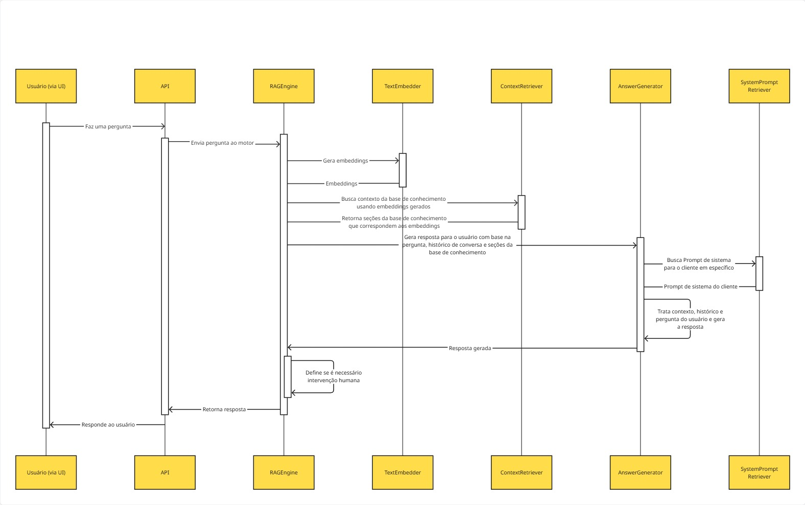

# ClaudIA

Essa aplicação implementa um pequeno chatbot que tem como objetivo responder perguntas baseadas em conteúdo de uma empresa específica.

## Como executar

Para executar a aplicação, copie o arquivo `.env.example`, renomeie para `.env` e preencha com as API Keys necessárias.

Depois, execute na raiz do projeto

```bash
docker compose up -d --build
```

Quando o docker compose finalizar, a aplicação estará de pé e ouvindo na porta `8080`. 

Faça suas requisições para `http://localhost:8080/api/conversations/completions`, no payload preencha o campo `projectName` como `tesla_motors`.

Exemplo:

```bash
curl --location 'http://localhost:8080/api/conversations/completions' \
--header 'Content-Type: application/json' \
--data '{
    "helpdeskId": 123456,
    "projectName": "tesla_motors",
    "messages": [
        {
            "role": "USER",
            "content": "What can you tell me about Tesla?"
        }
    ]
}'
```

## A solução

O código foi escrito em C# e é executado com .NET 10. A aplicação conta com diferentes componentes, cada um com uma responsabilidade específica.

A interação entre os principais componentes está ilustrada na imagem abaixo:



### Breakdown dos componentes

- **`RAGEngine`**: O orquestrador da solução. Responsável por receber o input do usuário e o histórico de mensagens, fazer os tratamentos necessários, solicitar busca de contexto e geração de resposta, definir se é necessária a intervenção humana e retornar uma resposta.
- **`TextEmbedder`**: Responsável por gerar embeddings a partir de um texto de entrada. Usa a API da OpenAI para fazer a geração dos embeddings.
- **`ContextRetriever`**: Responsável por buscar contexto para a pergunta na base de conhecimento (IDS) através da busca semântica. Deve usar os vetores criados pelo `TextEmbedder`. Usa o API do nosso VectorDB para fazer essa busca.
- **`AnswerGenerator`**: Responsável por buscar o prompt de sistema para o cliente e gerar uma resposta para o usuário dado o prompt de sistema, o contexto buscado da base de conhecimento, o histórico de conversação e a pergunta do usuário.
- **`SystemPromptRetriever`**: Responsável por buscar o prompt de sistema do cliente em específico. Para simplicidade, a implementação atual conta apenas com um hashmap em memória, é possível incrementar a solução conectando uma base de dados com os prompts de todos clientes.

### Outros componentes relevantes

#### GlobalExceptionHandler

A aplicação conta com um controlador global de exceções não tratadas. A principal função desse controlador é fazer o log da exceção gerada, incrementando com o stack-trace da exceção e um identificador do erro. Esse identificador pode ser exibido pela UI para informar ao usuário que busque ajuda com o suporte técnico. Informando esse identificador é possível buscar a exceção exata no sistema de registro de logs. Esse identificador pode ser substituído pelo traceId da requisição ao implementar um sistema de tracing robusto.

#### TenantContext

Foi implementado um mecanismo global para controle de tenants. A ideia desse mecanismo é poder injetar informações do cliente (tenant) em qualquer ponto da aplicação sem precisar passá-lo como parâmetro. O contexto de tenant é instanciado antes de executar qualquer endpoint (via action filter, `TenantContextActionFilter`) e assume que todas as requisições específicas de um tenant contenham os campos `HelpdeskId` e `ProjectName` no corpo da requisição. Essa implementação pode ser melhorada fazendo com que as informações do cliente sejam recebidas por um header HTTP - fazendo com que não seja necessário ler o corpo da requisição.

#### Métricas

A aplicação também conta com instrumentação de métricas via Open Telemetry. Pela simplicidade e foco no escopo não fiz a integração com ferramentas de coleta e visualização.


